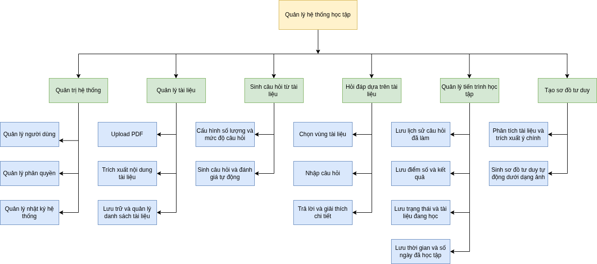

# AI Code Mentor

AI Code Mentor is a FastAPI-based backend for a pedagogical learning assistant and document question-answering system. The project integrates LangGraph/LangChain, WebSocket-based real-time chat, PDF processing, vector search, mind map generation, user management, and token/rate limiting.



## Key Features

- **Real-time Chat**: Interactive real-time chat via WebSocket at `/chat/pedagogical`.
- **Agentic Workflow**: Powered by LangGraph to dynamically route requests to appropriate tools for document processing, Q&A, summarization, mind map generation, and quiz creation.
- **PDF Processing**: Upload PDFs, store them securely in MinIO, and parse content using Gemini via OpenRouter.
- **Parallel PDF Parsing**: Highly concurrent PDF parsing using `RunnableLambda.batch(..., config={"max_concurrency": ...})`.
- **Vector Search & Retrieval**: Generate document embeddings using VoyageAI and store them in Qdrant.
- **Session Checkpointing**: Persistent conversation state tracking using PostgreSQL.
- **Rate Limiting & Token Tracking**: Manage API usage and token limits per user/session with Redis.
- **Observability**: Integrated LLM tracing and monitoring using Langfuse.
- **Interactive API Documentation**: Modern API documentation served via Scalar at `/apidocs`.

## Tech Stack

- Python 3.11+
- FastAPI
- LangChain, LangGraph
- OpenRouter / Gemini
- VoyageAI Embeddings
- Qdrant
- PostgreSQL
- Redis
- MinIO
- SQLModel
- Langfuse

## Project Structure

```text
.
├── app/
│   ├── main.py                   # FastAPI entrypoint (app factory + router mount)
│   ├── api/                      # HTTP/WebSocket layer — routing only
│   │   ├── deps.py               # FastAPI dependencies (auth, session)
│   │   ├── router.py             # every router mounted in one place
│   │   ├── v1/                   # REST endpoints
│   │   └── ws/                   # WebSocket endpoints
│   ├── core/                     # settings, paths, logging, security, errors
│   │   └── settings/             # auxiliary settings + their JSON data files
│   ├── db/                       # engine, generic table access
│   │   ├── base.py               # imports every model for SQLModel.metadata
│   │   └── models/               # SQLModel tables
│   ├── schemas/                  # Pydantic request/response DTOs
│   ├── services/                 # business logic (no agent imports it)
│   ├── infra/                    # MinIO, Redis, Qdrant vector store
│   ├── agents/                   # one self-contained package per agent
│   │   ├── registry.py           # the tools the orchestrator may use
│   │   ├── base.py               # LLM factory
│   │   ├── common/               # state + prompts shared by 2+ agents
│   │   ├── tools/                # tools shared by 2+ agents
│   │   └── document_processing/  # graph.py · nodes.py · prompts.py · schemas.py · tools.py
│   └── orchestrator/             # root LangGraph workflow routing across agents
├── data/                         # input corpus (pdfs/, doc/) — versioned
├── var/                          # runtime output (mindmaps, logs, results) — gitignored
├── scripts/                      # operational scripts (token gen, benchmark, MCP server)
├── tests/                        # unit/ · integration/ · e2e/ · fixtures/
├── notebooks/                    # exploratory notebooks
├── examples/                     # runnable demos
├── docs/                         # diagrams/ and assets/
├── deploy/                       # deployment assets (Dockerfile, db init)
├── pyproject.toml                # single source of dependencies + tool config
├── docker-compose.yml            # Redis, PostgreSQL, MinIO
└── README.md
```

### Dependency rule

```text
api → services → orchestrator → agents → infra → core → db
```

Imports only ever point right. In particular `app/agents/**` must never import
`app.api`; anything an agent needs from the API layer belongs in `app/services/`.

## Prerequisites

- Python 3.11 or higher.
- `uv` for dependency management.
- Redis for rate limiting and token tracking.
- PostgreSQL for application database and LangGraph checkpointer.
- Qdrant running at `localhost:6333` (or configured URL).
- MinIO running at the endpoint specified in `.env`.
- Poppler (`pdf2image` dependency) to convert PDF pages to images.

On Ubuntu/Debian, install Poppler using:

```bash
sudo apt-get install poppler-utils
```

## Setup & Installation

1. Install dependencies:

```bash
uv sync
```

2. Create environment file:

```bash
cp .env.example .env
```

3. Update key configurations in `.env`:

```env
OPENROUTER_API_KEY=...
EMBEDDING_KEY=...
SECRET_KEY=...
CHECKPOINT_PASSWORD=...
APP_PASSWORD=...
MINIO_ENDPOINT=localhost:9000
MINIO_ACCESS_KEY=admin
MINIO_SECRET_KEY=admin123
MINIO_BUCKET=mybucket
MIND_MAP_MODEL=gemini-2.5-flash
```

Do not commit actual secrets to the repository.

## Running Auxiliary Services

`docker-compose.yml` configures Redis and two PostgreSQL services:

```bash
docker compose up -d codeMentor-ratelimit codeMentor-checkpointer codeMentor-app
```

MinIO and Qdrant should be run separately if not already available locally. For example:

```bash
docker run -d --name qdrant -p 6333:6333 qdrant/qdrant
docker run -d --name minio -p 9000:9000 -p 9001:9001 \
  -e MINIO_ROOT_USER=admin \
  -e MINIO_ROOT_PASSWORD=admin123 \
  minio/minio server /data --console-address ":9001"
```

## Running the Application

```bash
uv run python -m app.main
```

Or:

```bash
uv run uvicorn app.main:app --host 0.0.0.0 --port 8686 --reload
```

Verify the health check endpoint:

```bash
curl http://localhost:8686/ping
```

Open API docs:

```text
http://localhost:8686/apidocs
```

## Primary Endpoints

- `GET /ping`: Health check.
- `GET /apidocs`: Scalar API documentation.
- `WS /chat/pedagogical`: WebSocket real-time agent chat.
- `POST /upload`: Upload PDFs to MinIO and record metadata.
- `PUT /update-file-active`: Activate files, parse PDF content, and ingest embeddings into Qdrant.
- `GET /session-files/{session_id}`: Retrieve uploaded files by session ID.
- `GET /view-file`: View uploaded PDF pages as base64-encoded images.
- `GET /get-mindmap`: Retrieve base64-encoded mind map images.
- `GET /get-mindmap-url`: Generate a presigned URL for the mind map.

## PDF Parsing Configuration

PDF processing configurations are defined in `app/core/config.py` and can be overridden via `.env`:

```env
PDF_PARSE_MAX_WORKERS=50
PDF_PARSE_RPM_LIMIT=500
PDF_PARSE_CHUNK_SIZE_SMALL=15
PDF_PARSE_CHUNK_SIZE_LARGE=30
PDF_PARSE_CHUNK_SIZE_THRESHOLD=50
PDF_PARSE_RETRY_ATTEMPTS=3
PDF_PARSE_RETRY_DELAY=2
```

The PDF parser uses Gemini via OpenRouter. Each chunk is processed in parallel using LangChain's runnable batch:

```python
chunk_processor.batch(
    chunks_data,
    config={"max_concurrency": max_concurrency},
)
```

## Quick Verification

Compile Python source files to verify syntax:

```bash
uv run ruff check app
```

Run the PDF processing test script (requires valid API keys and sample files):

```bash
uv run python tests/integration/test_parallel_processing.py
```

## Operation Notes

- WebSocket chat requires a valid JWT token.
- Redis is utilized for token usage and rate limiting.
- PostgreSQL checkpointer manages and persists conversational states by `thread_id`.
- Qdrant must be running before generating and storing document embeddings.
- MinIO must be accessible before uploading, viewing, or deleting files.
- Langfuse environment variables are optional but required if you want tracing enabled.
